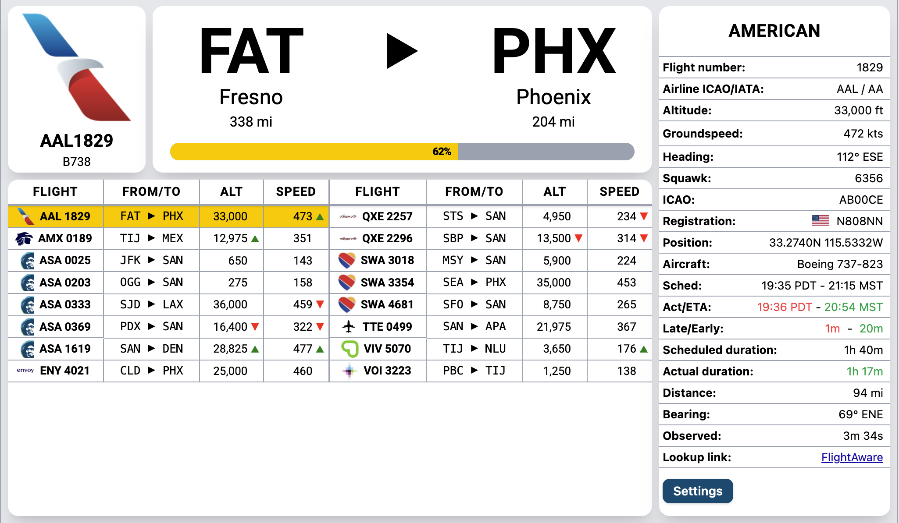
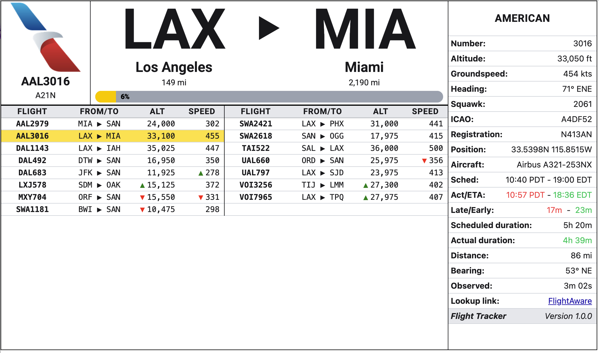

# Flight Tracker

Load this flight tracker application on a Raspberry Pi to track aircraft within
a given radius around any location.

## Application architecture

The application uses a Python back end to retrieve and save real-time flight tracking
data and hosts a web front end running on Chromium to display the information.

## Hardware requirements

I started with a Raspberry Pi 3B+, 32GB SD card running Raspbian Trixie OS (current as of Jun 2026).
Internet connectivity is required so if you're using a 3B+ you'll need a separate WiFi dongle.
The display is a Wimaxit M1012 10.1" touchscreen; the size provides a good balance between
compact size yet able to display comprehensive information.

I'm pretty sure that this will work with newer Raspberry Pi models
like the 4, and 5, and possibly with the Pi Zero, though I haven't
tested any other models. Let me know if you have success with other
models and I'll update this README.

## Instructions

### OS imaging and setup

1. Use the Raspberry Pi Imager to flash your SD card with Raspbian Trixie OS. You will need to download the Desktop
   version.
    * It will be useful to include Raspberry Pi Connect functionality to make it easier to set up and configure the Pi remotely
      from your computer. You can do the set up with a keyboard and mouse plugged into the R-Pi, but it's more tedious and cumbersome.  
2. Start the Pi and connect to it via Raspberry Pi Connect (or by your chosen method).

### Disable screen blanking and virtual keyboard

Open a terminal window and run `sudo raspi-config`
    * Select "Display Options"
    * Select "Screen Blanking"
    * Select "No"
    * Select "OK"
    * Select "Display Options"
    * Select "On screen keyboard"
    * Select "Always off"
    * Select "OK"

### Create an autostart script

1. Open a terminal window and enter `nano ~/start_dashboard.sh`.  Copy / paste this code and save the file:

    ```bash
    #!/bin/bash
    
    # Start the Python server in the background
    cd ~/flight-tracker/server
    source venv/bin/activate
    uvicorn main:app --port 8000 >> server.log 2>&1 &
    
    # Wait 10 seconds for your backend data to serialize
    sleep 10
    
    # Launch Chromium in Wayland kiosk mode pointing to your Preact app
    chromium --kiosk --noerrdialogs --disable-infobars --no-first-run --disable-gpu --disable-sync --password-store=basic --incognito --ozone-platform=wayland 'http://localhost:8000' &
    ```

2. Make the script executable by running `sudo chmod +x ~/start_dashboard.sh` from the terminal.
3. Check to see if there is a folder at `~/.config/labwc`.  If there is, continue to the next step.  If not, then create this folder
4. Open a terminal window and run `sudo nano ~/.config/labwc/autostart`.
5. Add `/home/pi/start_dashboard.sh >> /home/pi/kiosk.log 2>&1 &` at the bottom of this file

### Python configuration

From Raspberry Pi Connect open up a remote terminal and run the following commands:

```bash
git clone https://github.com/rogerjaffe/flight-tracker.git
cd flight-tracker/server
python3 -m venv venv
source venv/bin/activate
pip install -r requirements.txt
```

### Set up the user configuration

1. Open the `~/flight-tracker-py-web/server/config.py` file in the project root
2. In the [user] section set the latitude and longitude of the point around which you want to find flights.
3. Set the view radius (in km). You may need to adjust the radius depending on the amount of airplane traffic in your
  area. Busier airspace should have a smaller radius to avoid overloading the source API. If you find that flights are
  not being retrieved try reducing the radius.

### Set up the ADSB server configuration

The software can read ADSB data provided by `https://airplanes.live`, however this data is
rate-limited to not overload their API servers.  You can also use ADSB data if you are hosting ADSB receivers like those
provided by FlightAware or FlightRadar24, or your own custom receiver.

1. Open the `~/flight-tracker-py-web/server/config.py` file in the project root
2. In the `Local ADS-B receivers section` you'll find two FlightAware ADS-B receivers that
I'm hosting on my local network.  Your configuration will be similar.  Use the `is_enabled` 
variable to enable or disable the server.
3. If you don't have any hosted ADS-B devices, set the `is_enabled` variable to `False` and
set the `is_enabled` variable in the `Airplanes Live` section to `True`.
4. If you are using the Airplanes Live server, do not change the `interval` value.
5. Depending on the amount of air traffic in your area you may have to reduce the `radius` value
in the `user` section at the top of the page.  The rate limit depends on the number of flights that
are retrieved.  The more flights, the longer the delay must be between issuing requests.

### Customizing other configuration options

You can customize other options by staying in `config.py` and scrolling down to the 
bottom of the file. Customize other options here in the same fashion as in the UserConfig
class in the same part of the file.

    width                           # Display width in pixels
    height                          # Display height in pixels
    stale_age_seconds               # Age in seconds with no ADSB update
                                    # after which a flight is removed
    display_new_flight_interval     # Seconds to wait until displaying a new flight
    refresh_flight_list_interval    # Refresh flight list interval
    get_flight_list_interval        # Seconds to wait before getting new flight details from the list
    get_dark_mode_interval          # Minutes to wait before checking for dark mode
    clean_interval                  # Seconds between cleaning up old data

Don't change these configuration options unless you know what you're doing.

    airline_logo_url                # URL to retrieve airline logos
    airline_logo_url_ext            # File extension for airline logos
    proxy                           # URL for the proxy server this app creates
    flight_aware_flight_lookup      # URL to retrieve flight details from FlightAware
    flag_url                        # URL to retrieve aircraft flags
    flag_url_ext                    # File extension for aircraft flags

### Test the full application and autostart

1. Navigate to the root folder `cd ~`
2. Start the application by running `sudo start_dashboard.sh` from the terminal.
3. If everything works correctly, you should see a Chromium window open up with no menu or task bar and no Chromium
  title bar.
4. When the application is running you won't be able to close the app or run other applications. You can open a terminal
  window with the Ctrl-Alt-T keyboard shortcut. You can also connect to a terminal remotely through Raspberry Pi
  Connect.
5. You can stop the app from the terminal by doing these steps:
   * Run the command `ps aux | grep "python"` and killing all process numbers that appear
     in the list.
   * Run the command `ps aux | grep "chromium"` and kill the first process number that appears in the list.

### Final checkout

* If the test above works then open a terminal and run `sudo reboot`.
* When the Pi reboots it should load the application automatically.
* If something goes wrong you can view the log file at `~/kiosk.log` to diagnose the problem.

### Controls

* Tap the right-facing arrow between the origin and destination airport codes to switch between the flight view,
  distance view, summary view, track map, and aircraft pictures.
* The application will automatically go into dark mode between sunset and sunrise for the latitude / longitude that's configured in
  `config.ini`
* Click the `Settings` button to open the settings menu.
    * Click the `Dark mode` checkbox to force dark mode, even during the day.
    * Click the `Rotate flight list and map` to rotate the display between the information displays.
    * Use the `Rotate view interval` to change the seconds before the display is switched to the next view.

### Screenshots

<p align="center">
  
</p>

<p align="center">
  
</p>

### Acknowledgements

#### Inspiration for this project comes from these two Raspberry Pi projects:

* [R-Pi Flight Tracker #1](https://github.com/ColinWaddell/FlightTracker?tab=readme-ov-file)
* [R-Pi Flight tracker #2](https://github.com/c0wsaysmoo/plane-tracker-rgb-pi)
* [Flight tracker Python / Javascript library](https://github.com/JeanExtreme002/FlightRadarAPI)

#### Open source libraries used in this project:
##### Python
* [Python](https://www.python.org/) for providing the back end framework
* Also see the list in `server/requirements.txt`

##### Typescript
* [Preact](https://preactjs.com/) for providing the front end framework
* [Tailwind CSS](https://tailwindcss.com/) for providing the CSS framework

##### Raspberry Pi
* [Chromium](https://www.chromium.org/) for providing the web browser engine
* [Raspberry Pi](https://www.raspberrypi.org/) for providing the hardware platform
* [Raspbian Trixie OS](https://www.raspberrypi.org/software/operating-systems/) for providing the operating system

##### Real time data sources and images
* [FlightAware](https://www.flightaware.com/) for providing the ADS-B receivers and airline logos
* [FlightRadar24](https://www.flightradar24.com/) for providing information about flights
* [JetPhotos](https://www.jetphotos.com/) for providing the aircraft images via FlightRadar24
* [FlagCDN](https://flagpedia.net) for providing the country flags

#### Please use these sources for your own educational projects only and use them responsibly!

#### MIT License

Permission is hereby granted, free of charge, to any person obtaining a copy
of this software and associated documentation files (the "Software"), to deal
in the Software without restriction, including without limitation the rights
to use, copy, modify, merge, publish, distribute, sublicense, and/or sell
copies of the Software, and to permit persons to whom the Software is
furnished to do so, subject to the following conditions:

The above copyright notice and this permission notice shall be included in all
copies or substantial portions of the Software.

THE SOFTWARE IS PROVIDED "AS IS", WITHOUT WARRANTY OF ANY KIND, EXPRESS OR
IMPLIED, INCLUDING BUT NOT LIMITED TO THE WARRANTIES OF MERCHANTABILITY,
FITNESS FOR A PARTICULAR PURPOSE AND NONINFRINGEMENT. IN NO EVENT SHALL THE
AUTHORS OR COPYRIGHT HOLDERS BE LIABLE FOR ANY CLAIM, DAMAGES OR OTHER
LIABILITY, WHETHER IN AN ACTION OF CONTRACT, TORT OR OTHERWISE, ARISING FROM,
OUT OF OR IN CONNECTION WITH THE SOFTWARE OR THE USE OR OTHER DEALINGS IN THE
SOFTWARE.